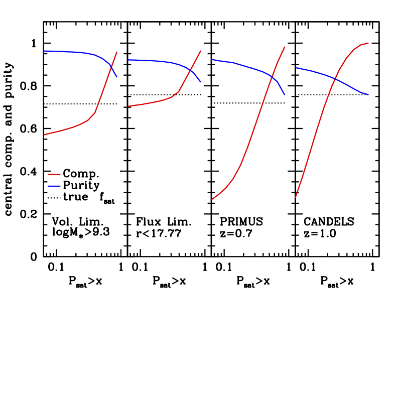

# IsolationCriterion

This code takes in an ascii file of positions and stellar masses of galaxies, and return a satellite probability estimate for each object. The usage of the code is:

isolation_condition inputfile > outputfile

where the columns in [inputfile] are:
 1) ra [degrees]
 2) dec [degrees]
 3) redshift
 4) log10(Mstellar) Msol units
 
The output file has two columns:
 1) P(sat)
 2) Indx. if(Psat)>0, this is the index of the larger galaxy that is most likely the host halo. Otherwise, -1.
 
The output can be cut two ways:
 1) P(sat)<0.1. A "pure" sample of central galaxies.
 2) P(sat)<0.5. A "complete" sample of central galaxies.
 
The pure sample is pure relative to a full group-finding algorithm (compared to the group catalog's sample of pure centrals), to ~98% at all stellar masses. The completenss of the pure sample (relative to the group catalog's pure sample) is about 70%. The completenss of the pure sample relative to everthing the group catalog calls a central (P[sat]<0.5) is ~60%.

The complete sample is pure relative to the full catalog central sample at about 95%. The complete sample is complete relative to the full catalog of all centrals at about 75%. 

The following plot shows the performance of the code under various conditions.

